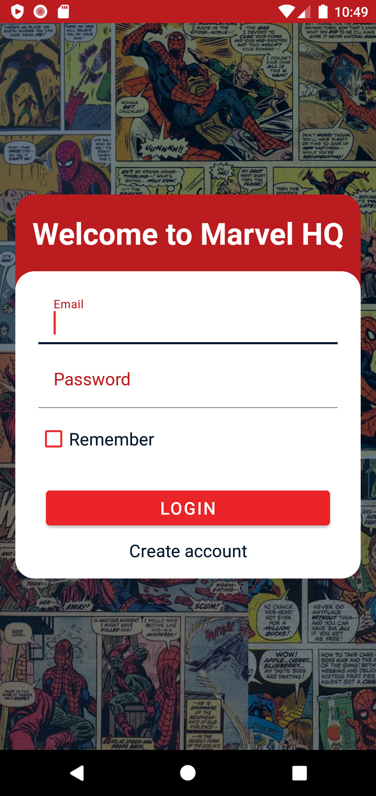
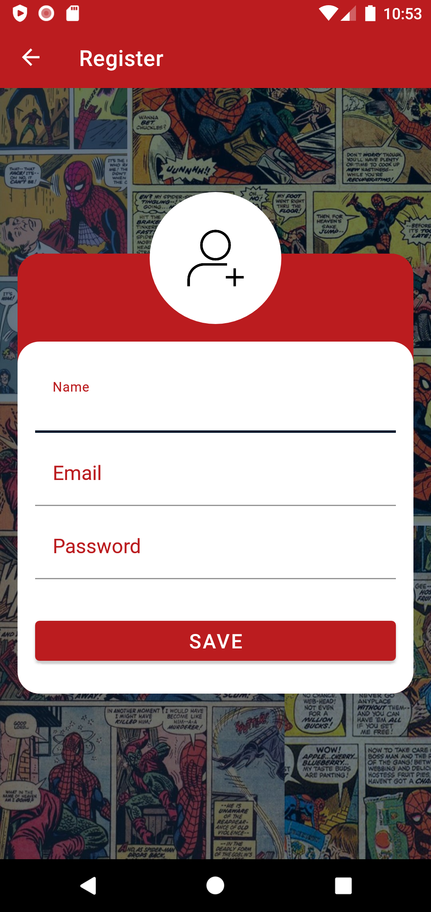
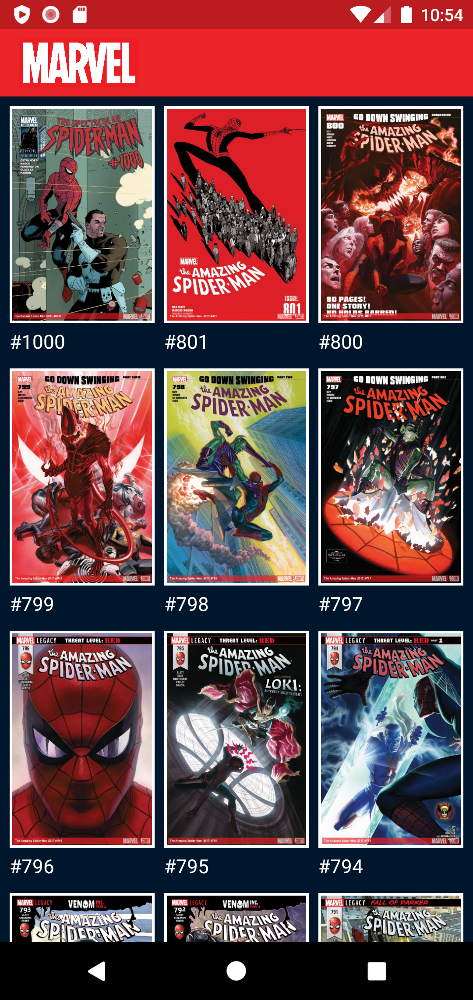
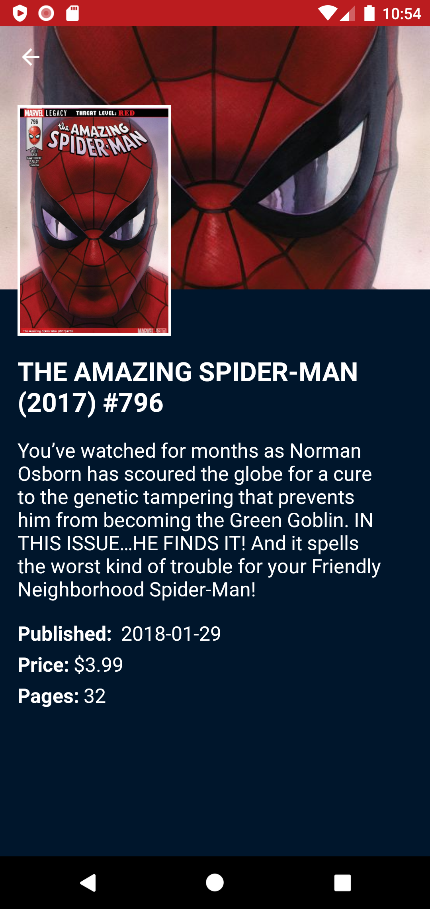

# Desafio Marvel - Web Service

Repositório destinado ao desafio do curso de Desenvolvimento Mobile Android ministrado pela Digital House.

### ScreenShots

  
  
  
  
  
  

  
### Preview

  

### Requisitos mínimos de entrega

- [x] Seguir o [protótipo][prototipo]
- [x] Tela de splash
- [x] Tela de home que liste no mínimo 50 HQ's
- [x] Tela de detalhe do HQ
- [x] Tela de detalhe da imagem(expansão da imagem)

[prototipo]: <https://marvelapp.com/194b601g/screen/53575549>
